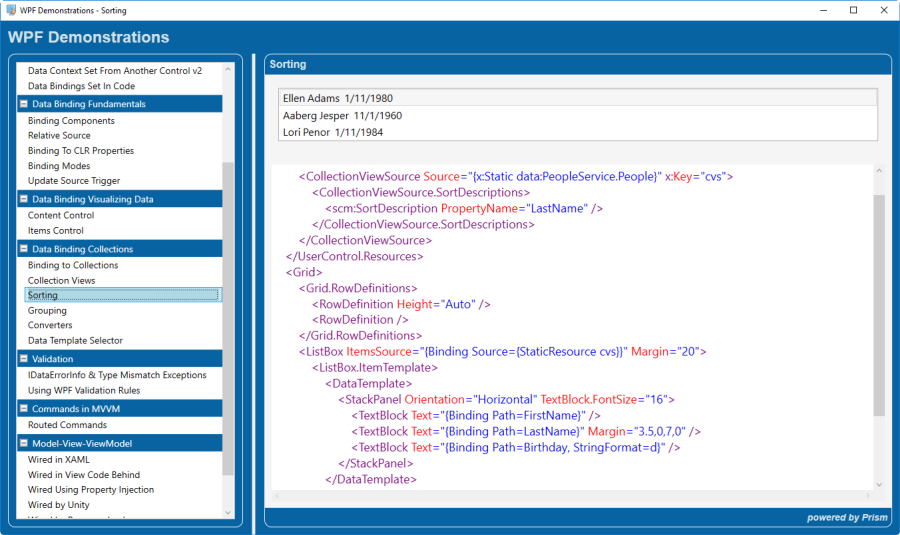
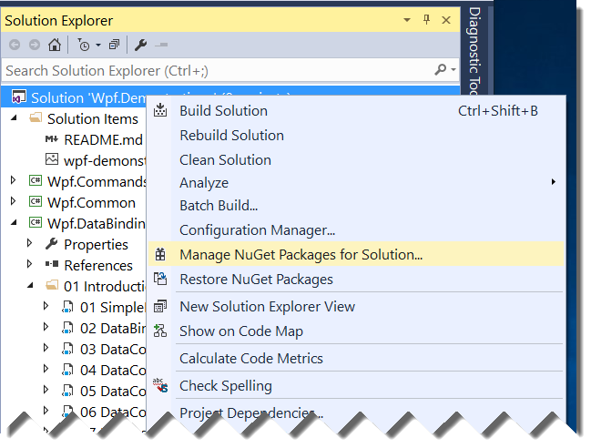

# WPF Demons

This repro has 4 WPF Prism/MVVM applications used for presentations and training.

* Wpf.Demonstrations
* XamlDeveloper
* AsyncDataAccess
* WpfDesignTimeData

## Wpf.Demonstrations

This is a WPF/Prism Application that replaces a PowerPoint slide deck when for teaching the topics in this application such as:

* In depth Data Binding
* Commands
* MVVM
* Prism Navigation
* WPF Data Validation

### Usage
When I'm teaching these topics, I run the application and simply navigate to the topic.

The below image pictures the app running.  Notice the XAML for the form is also displayed.  This makes it real easy to cover the topic without having to switch back to Visual Studio.  Attendees can see the form and XAML.

In this example, explaining CollviewSource Sorting and a simple DataTemplate is super easy.

## XamlDeveloper

This is an Introduction to XAML teaching application. Instead of using PowerPoint slide deck, the teaching topic and code runs inside the app. It touches MVVM and demonstrates how to unit test a view model with 100% test coverage, including testing dialog input from the user. 

## AsyncDataAccess

This sample shows how to provide a promise like API for making TPL library calls for async operations.  It also has a button that will cause the service to throw so that you can follow the flow and how the code handles the exception and displays a dialog to the user.

## WpfDesignTimeData

This sample shows five techniques for getting sample data to show on the XAML Designer at design-time.

## Downloading or Cloning and then Running the Application
After downloading or cloning this repro, open the solution in Visual Studio, you MUST **Manage NuGet Packages for Solution** as pictured below.

When the NuGet Package Manager opens, update all packages and then you MUST **restart Visual Studio.**

## Building this Application
This is a WPF/Prism application, that leverages run-time module loading without any references to the assembly.

None of the assemblies are referenced by the main project, "Wpf.Demonstrations."

Instead, the modules are loaded at run-time and then self-register themselves with the Unity Container, and add their menu items to a shared collection.

This is how some Prism apps are written.  This is not a requirement but, demonstrates a technique of Prism app development.

## Modifying the Application
If you decide to modify this application you MUST always perform a Solution Rebuild.  This is required to get all the assemblies copied into the correct locations.  Remember the Wpf.Demonstrations application does not reference other assemblies, so we must copy the assemblies to the correct location so the application will run correctly.

Visit the Prism Home page to learn all about [Prism!](https://github.com/PrismLibrary/Prism)

